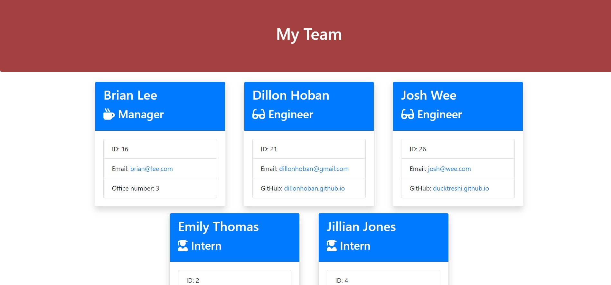

# Team Generator
An easy to use CLI application for generating information about your company team and rendering it to a styled html document. 

 
 

  
  
  
  

[Click here](https://drive.google.com/file/d/19PBRbshe2yQWwvAEemA8qPcpUW0x3Pkn/view) to view a working demo of the app running!

## Installation
<ul>
<li>Requires install of Node.js
<li>Clone this repository to your local machine
<li>In the CLI of your choice, run <strong>npm i -y</strong> to install necessary node modules
<li>Run <strong>node app.js</strong> to run the app in your browser
<li>Run <strong>start .\output\team.html</strong> to view your team document in your browser!
</ul>

## Acknowledgments
A special thank you to [Christina](https://github.com/Christina2021), [Ravi](https://github.com/ravifindravicom), [Brian](https://github.com/btparker70), and [Emily](https://github.com/ethomas22) and all the members of the Awesome Study Group. 

## Validation 
This site’s HTML was validated using a third party service found [here.](https://validator.w3.org/)

## License
[MIT](https://choosealicense.com/licenses/mit/)